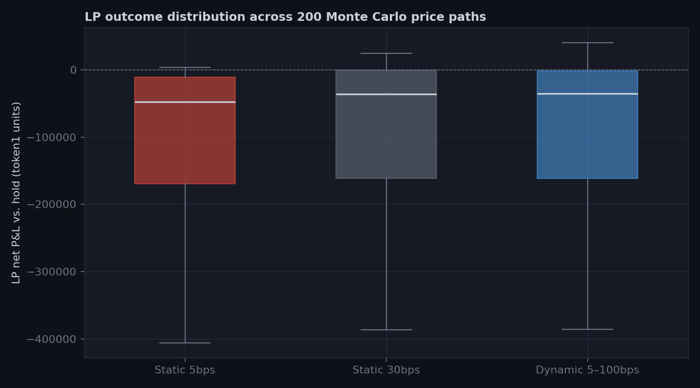
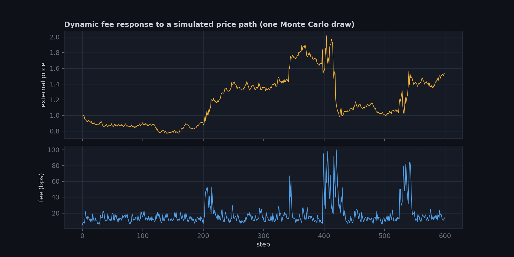

# Adaptive-Fee AMM

A constant-product AMM where the swap fee scales with the pool's own
realized short-term volatility, instead of sitting at one number forever.

The problem this targets: LPs in a fixed-fee pool (Uniswap V2, and V3
within a tick range) lose systematically to arbitrageurs whenever the
external market price moves faster than the fee compensates for — this is
"loss-versus-rebalancing" (LVR), formalized in Milionis, Moallemi,
Roughgarden & Zhang (2022/2023). A fixed fee has to be set once for both
regimes: too low and arbitrageurs eat the pool alive during volatile
periods; too high and it drives away the retail volume that's actually
profitable for LPs to serve. This repo builds a pool that raises its fee
specifically when recent swaps look like informed/arbitrage flow, and
lets it fall back to a floor otherwise, and then measures whether that
actually helps.

**[Read the results →](reports/research_note.md)**





**Headline finding, 200 Monte Carlo paths**: the dynamic-fee pool matches
a high static fee's LP protection while capturing more retail volume than
that same high fee — because the fee only spikes during the (minority)
turbulent windows and sits at its floor the rest of the time. See
`reports/figures/02_pnl_vs_retail_volume.png`.

## What's here

| Path | What it does |
|---|---|
| `contracts/AMMPool.sol` | Abstract constant-product pool — reserves, LP share accounting, swap execution. Fee is a hook (`currentFeeBps()`), so the static and dynamic pools share every line except the fee rule. |
| `contracts/StaticFeePool.sol` | Fixed-fee implementation — the Uniswap V2-style baseline. |
| `contracts/DynamicFeePool.sol` | Fee = base + sensitivity × EWMA(realized price volatility), clamped to [min, max]. See the contract docstring for the exact mechanism and the LVR motivation. |
| `contracts/test/MockERC20.sol` | Open-mint ERC20 test fixture. |
| `py/compile.py` | Compiles all contracts with the vendored `solc` binary. |
| `py/chain.py` | Deploy/interact helper on a local eth-tester EVM (no Foundry/Node — see below for why). |
| `py/test_pool.py` | 8 tests against the real deployed bytecode: LP accounting, swap-vs-formula correctness, the constant-product invariant net of fees, and that the dynamic fee actually rises/decays with realized volatility. |
| `py/pool_sim.py` | Pure-Python replica of the exact on-chain integer arithmetic, for fast Monte Carlo. |
| `py/validate_sim.py` | Cross-checks `pool_sim.py` against the real contract, state-for-state, on random swap sequences — this is what licenses using the fast replica for the experiment below. |
| `py/lvr_experiment.py` | The Monte Carlo: two-state stochastic-vol price paths, an optimal arbitrageur, fee-elastic retail flow. |
| `py/run_experiment.py` | Runs the full 200-path experiment, writes `reports/figures/` and `reports/research_note.md`. |
| `deploy/deploy_testnet.py` | Deploys both pools + demo tokens to Sepolia (or a local chain with `--local`), writes `deploy/deployment.json`. |
| `deploy/build_standard_json.py`, `deploy/verify_etherscan.py` | Etherscan source verification, using the exact solc standard-json-input rather than hand-flattened source. |
| `backend/indexer.py` | Polls both pools for events, caches them in SQLite. |
| `backend/api.py` | Read-only FastAPI over that cache, plus one live on-chain read endpoint. |
| `backend/test_e2e_local.py` | Single-process validation of deploy → swap → index → serve (see "multi-process local testing" below for why it's one process). |
| `frontend/` | Vanilla HTML/JS (ethers.js + Chart.js, vendored locally — no CDN dependency, no build step). Connect a wallet, read live pool state, swap against either pool, see the fee history. |

## Running it

```bash
pip install -r requirements.txt
bash tools/fetch_solc.sh       # downloads solc-static-linux from GitHub releases
python py/compile.py          # compiles contracts/*.sol with tools/solc
pytest py/test_pool.py -v     # 8 tests against the real deployed bytecode
pytest py/validate_sim.py -v  # confirms the fast Python replica matches the chain exactly
python py/run_experiment.py   # full Monte Carlo -> reports/figures/ + research_note.md
```

## Going from "runs in a test" to "a real person can use it"

Everything above proves the mechanism is correct. It doesn't let anyone
who isn't you run the code touch it. Getting there is three steps, in
order — skip straight to a frontend and you'll be debugging against a
moving target with no way to tell contract bugs from UI bugs.

### 1. Deploy to Sepolia testnet

```bash
export SEPOLIA_RPC_URL="https://eth-sepolia.g.alchemy.com/v2/<your-key>"
export DEPLOYER_PRIVATE_KEY="0x..."   # a fresh burner wallet — never reuse a real one
python deploy/deploy_testnet.py
```

You'll need, both free:
- An RPC endpoint — create an app on [Alchemy](https://alchemy.com) or
  [Infura](https://infura.io) for "Ethereum Sepolia."
- Testnet ETH for gas — a few cents' worth from
  [sepoliafaucet.com](https://sepoliafaucet.com) or your RPC provider's
  own faucet is enough for this contract's deployment + a handful of swaps.

This writes `deploy/deployment.json` with the real on-chain addresses.
`deploy/deploy_testnet.py --local` runs the identical code path against
a local eth-tester chain first if you want to sanity-check it before
spending real (testnet) gas — that's how it was validated while building
this in a sandbox with no RPC access at all.

### 2. Verify the source on Etherscan

```bash
export ETHERSCAN_API_KEY="..."   # free at etherscan.io/apis
python deploy/build_standard_json.py
python deploy/verify_etherscan.py
```

This is the step that actually matters for credibility: once verified,
anyone — an interviewer, a PhD committee member — can open the contract
on Etherscan, read the real source, and call `currentFeeBps()` themselves
without trusting anything you say about it.

### 3. Run the indexer + API, then open the frontend

```bash
python backend/indexer.py --backfill-from-block <deployment_block> --once   # one-time catch-up
python backend/indexer.py &                                                   # then leave it polling
uvicorn backend.api:app --port 8000 &
python frontend/serve.py
```

Edit `frontend/config.js` with the addresses from `deploy/deployment.json`
and your RPC URL, then open `http://localhost:5173`. Connect MetaMask
(switch it to Sepolia), mint yourself demo tokens, and swap against both
pools side by side — the fee difference is live, not a chart of past
data.

**Why a backend at all, if the frontend reads the chain directly?**
Current pool state (`/api/live-state`) is read live from chain — the
backend doesn't sit in that path. The backend exists only for the fee
history chart, which needs "give me the last 200 swaps" and re-scanning
the whole chain from the browser on every page load doesn't scale even
at demo traffic. SQLite, no ORM, no user accounts — see
`backend/indexer.py`'s docstring for why this is deliberately not a
general-purpose backend.

**Multi-process local testing**: eth-tester (used for the tests above)
lives in one process's memory, so it can't be shared between separate
`deploy` / `indexer` / `uvicorn` processes the way a real chain can.
`backend/test_e2e_local.py` validates the indexer-to-API pipeline in a
single process for that reason. To actually run deploy → indexer → API
→ frontend as four separate local processes before spending testnet gas,
install [Foundry](https://getfoundry.sh) on your own machine (not
possible in the sandbox this was built in) and run `anvil` as a
persistent local node — then point `SEPOLIA_RPC_URL` at
`http://localhost:8545` instead of a real testnet endpoint. The contracts
and scripts don't change either way.

## Why no Foundry/Hardhat

This was built in a sandbox with no outbound access to `foundry.paradigm.xyz`
or npm's install scripts. `tools/solc` is the official `solc-static-linux`
binary pulled directly from the `ethereum/solidity` GitHub releases page,
and `py/chain.py` runs contracts on `eth-tester` (a pure-Python EVM
implementation) via `web3.py` — both plain `pip install`s. This isn't a
lesser substitute: `py/test_pool.py` runs against the actual compiled
bytecode with real EVM semantics (reentrancy guard, integer overflow
checks, event logs), not a mock. Porting to Foundry (`forge test`,
`forge script` for deployment) is a mechanical follow-up if you want the
faster iteration loop or plan to deploy to a real testnet — the contracts
themselves don't need to change.

## Scope decisions worth defending in an interview

It's tempting to keep adding infrastructure — a production Postgres+Redis
backend, a CI/CD pipeline, monitoring dashboards, a mainnet deployment.
None of that is here, on purpose:

- **No Postgres/Redis, no user accounts.** The chain is already the
  database. The only thing worth caching locally is event history for
  charts, and SQLite is the right tool for a single-writer cache that
  size — adding a database server here would be infrastructure with no
  corresponding problem.
- **No mainnet deployment.** A real audit (the kind that would justify
  putting real value behind these contracts) costs real money and weeks,
  from firms like Trail of Bits or OpenZeppelin, and even audited
  protocols get exploited. Deploying unaudited contracts to mainnet adds
  real financial and legal risk for zero credibility gain over a verified
  testnet deployment — nobody evaluating this project needs it to hold
  real money to evaluate whether the mechanism and the code are sound.
- **No CI/CD pipeline.** This is a portfolio project with one contributor
  and no ongoing release cadence; a pipeline here would be automating a
  process that doesn't exist yet.

The bar this repo is held to instead: a stranger can open the verified
contract on Etherscan, read every line, and independently confirm the
fee logic does what the README claims — that's a higher bar than a
private backend anyone would have to take on trust.

## Design choices worth knowing about before you extend this

- **Fee state is a simple EWMA of absolute relative price change**, not a
  proper realized-variance estimator (no squaring, no annualization) —
  chosen so it's cheap enough to update in every swap's gas budget. A
  squared-return EWMA (closer to a true RiskMetrics-style variance) is a
  reasonable upgrade if gas isn't the binding constraint.
- **The arbitrageur and retail-flow models in `lvr_experiment.py` are
  deliberately simple** (single idealized arbitrageur, exponential fee
  elasticity for retail) — the point was to make the LVR-vs-volume
  tradeoff visible and quantifiable, not to model real MEV competition or
  measure actual router fee sensitivity. See `reports/research_note.md`
  §"Where this doesn't hold" for what's assumed vs. what's measured.
- **`DynamicFeePool`'s parameters (sensitivity, EWMA alpha, fee bounds)
  were chosen by hand** to produce a clear, testable response — not fit
  to any specific asset's data. Calibrating them properly is the natural
  next step, and the sibling repo's order-flow analysis is a plausible
  data source for that (see research note).

## Next steps

- Port `DynamicFeePool.sol` into an actual Uniswap v4 hook and backtest
  against a real historical pool's swap log instead of simulated flow.
- Replace the single idealized arbitrageur with a small population of
  boundedly-rational agents with heterogeneous gas costs, so LVR
  extraction isn't assumed to be 100% efficient at every fee level.
- Calibrate the fee-response parameters against real order-flow data
  (see [`onchain-microstructure`](../onchain-microstructure), the sibling
  repo this project's fee mechanism is designed to eventually consume
  signals from) instead of hand-picked constants.

## References

- Milionis, J., Moallemi, C., Roughgarden, T., & Zhang, A.L. (2022/2023).
  *Automated Market Making and Loss-Versus-Rebalancing.*
- Angeris, G., & Chitra, T. (2020). *Improved Price Oracles: Constant
  Function Market Makers.*
- Uniswap Labs (2023). *Uniswap v4 Core* — hook architecture that this
  contract's fee-per-swap-from-pool-state design is conceptually aligned
  with, though this repo doesn't target v4's exact hook ABI.
